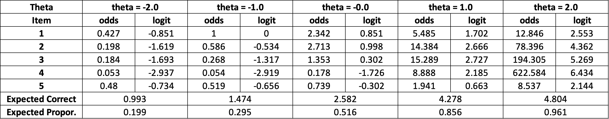

```{=latex}
\setcounter{tocdepth}{4}
\tableofcontents
```
```{r setup, include=FALSE}
## Global options
knitr::opts_chunk$set(
  cache = TRUE,
  prompt = TRUE,
  comment = '',
  collapse = TRUE,
  warning = FALSE,
  message = FALSE)
```   

## Q1  

*Find the maximum discrimination for 1PL, 2PL, and 3PL logistic models...*  

**My Solution:**  
**2PL MODEL**  

I begin with a 2PL model since 1PL is a special case of 2PL. The ultimate purpose is to get the slope function $S(\theta)$ and take the first derivative of this slope function and let it equal to 0 to get the local maximum. One should notice that the slope function $S(\theta)$ is actually the first derivative of the 2PL function $P(\theta)$. Follow this idea, I derive the conclusion step by step:  


For the 2PL model, $$P(\theta)=\frac{1}{1+e^{-\alpha(\theta-\beta)}},$$ let $Z = \alpha(\theta-\beta)$, $U = e^{-Z}$, and then $P = \frac{1}{1+U}$. Using the chain rule and take the partial derivative on $\theta$, one can have $$\frac{\partial P}{\partial \theta}=\frac{\partial P}{\partial U}\frac{\partial U}{\partial Z}\frac{\partial Z}{\partial \theta}. $$ Since $$\frac{\partial P}{\partial U}=\frac{-1}{(1+U^2)},$$ $$\frac{\partial U}{\partial Z}=-e^{-Z},$$ and $$\frac{\partial Z}{\partial \theta}= \alpha,$$ plug all three partial derivatives into the overall equation. One can have the slope function $$S(\theta)=\frac{\partial P}{\partial \theta}=\frac{\alpha e^{-z}}{(1 + e^{-z})^2}.$$ Next, continue to take the first derivative of this slope function, one can have $$S'(\theta)=\frac{\partial^2 P}{\partial \theta^2}=\alpha^2[\frac{-2U}{(1+U)^3}+\frac{1}{(1+U)^2}](-U),$$ $$S'(\theta)=\frac{\partial^2 P}{\partial \theta^2}=\alpha^2[\frac{U(1-U)}{(1+U)^3}].$$  

Let it equal to 0, and one can have $$U=e^{-\alpha(\theta-\beta)}=1.$$  It is not difficult to have the final solution $$\theta = \beta.$$ The maximum value of discrimination of a 2PL model is at the point $\theta =\beta$.  
Therefore, the maximum of the 2PL model's slope is $$\frac{1}{4}\alpha$$.

  **1PL MODEL**  
  
Since the 1PL is a special case of 2PL, plug the $\alpha = 1$ into the partial derivative of slope function $S'(\theta)$ above. One can easily have same conclusion that the maximum of slope of 1PL model is at the point $\theta = \beta$.  
Therefore, the maximum of the 1PL model's slope is $\frac{1}{4}.$

**3PL MODEL**  
For the 3PL model, follow the idea above. It is not difficult to get the slope function $$S(\theta)=\frac{\alpha (1-c) e^{-z}}{(1 + e^{-z})^2}.$$ Plug the $\theta=\beta$, one can easily have the maximum slope is $$\frac{1}{4}\alpha(1-c).$$  

## Q2  

*Let the discrimination, difficulty and guessing parameters of five items be...*  

**My Solution:**  
First, I write a 3PL model function:  
```{r}
# items' discrimination
a_ <- c(0.5,1,1.5,2.5,1)
# items' difficulty levels
b_ <- c(-1,-0.5,0,0.5,1)
# items's guessing parameters
c_ <- c(0,0.1,0.15,0.05,0.32)
# trait vector
theta_ <- c(-2.0, -1.0, 0,1,2)
# write a 3PL model
irt_3pl <- function(theta,a,b,c){
  z <- 1.702*a*(theta - b)
  output <- c + (1-c)/(1+exp(-z))
  return(output)
}
```  
Next, for each test-taker (i.e., each trait), get the required values iteratively.  
```{r}
# using a for-loop to get the values
for (j in 1:5) {
  #print(paste0("-------------For the theta =", theta_[j]," : -------------"))
  exp_cor <- 0
  for (i in 1:5) {
    #print(paste0("-----For the item i=", i," : -----"))
    P <- irt_3pl(theta= theta_[j], 
                 a=a_[i], b=b_[i], c=c_[i])
    Q <- 1-P
    # get the odds
    odds <- round(P/Q,3)
    # get the logit
    logit <- round(log(odds),3)    
    # get the expected total score
    exp_cor <- exp_cor + P
    # print the results for this student
    #print(paste0("Odds: ", odds," ."))
    #print(paste0("Logit:", logit," ."))
  }
  # get the expected proportion of correct
  prop <- round(exp_cor/5,3)
  #print(paste0("Expected Correct #:", exp_cor," ."))
  #print(paste0("Expected Correct proportion:", prop," ."))
}
```  
To make the layout good-looking, I loaded the results into a table as followed.  

  

  
## Q3-Part a  
*Find the maximum likelihood estimates of the item parameters under...*   
  
**My Solution**  

```{r}
# load the given values
## the assumed theta_j
theta_set <- seq(-3,3,by =0.5)
## number of correct responses for each theta_j
r_set <- c(0,0,1,2,3,4,5,6,4,4,4,2,1)
## number of respondents for each theta_j
f_set <- c(1,2,4,7,8,9,10,8,6,5,5,2,1)

# get the proportion of correct responses for each theta_j
p_set <- r_set/f_set

# to count the iteration times
iter_time <- 0
deltas <- t(t(c(10,10)))
zeta <- 0
lambda <- 1.0

while((abs(deltas[1,1])>0.005) & (abs(deltas[2,1])>0.005)) {
  # set the initial value
  iter_time <- iter_time+1
  # define the 2PL model:
  # note, both the input and output are vectors rather than scalars
  P <- 1/(1+exp(-(zeta+lambda*theta_set)))
  Q <- 1-P
  
  # define the weight in case of using normal ogive in the future
  W <- P*Q
  
  # Define the L1, L11, L2, L22, L12
  # Note, to make computation efficient, I use matrix operation
  vec_tempt_1 <- (p_set -P)/(P*Q)
  vec_tempt_2 <- (p_set -P)*theta_set/(P*Q)
  theta_sq_vec <- theta_set^2
  L1 <- t(f_set)%*%diag(W)%*%t(t(vec_tempt_1))
  L2 <- t(f_set)%*%diag(W)%*%t(t(vec_tempt_2))
  L11 <- -t(f_set)%*%t(t(W))
  L22 <- -t(f_set)%*%diag(W)%*%t(t(theta_sq_vec))
  L12 <- -t(f_set)%*%diag(W)%*%t(t(theta_set))
  
  # make them into matrix form
  matrix_L <- matrix(c(L11,L12,L12,L22),2,2)
  vector_L <- t(t(c(L1, L2)))
  
  # get the delta zeta and delta lambda
  deltas <- -solve(matrix_L)%*%vector_L
  
  # update the zeta and lambda
  # note here is to add the deltas not to minus!!!!
  updated_parameters <- t(t(c(zeta, lambda))) + deltas
  zeta <-updated_parameters[1,1]
  lambda <- updated_parameters[2,1]
}
print(deltas[1])
print(deltas[2])
print(paste0("The iteration time is: ", iter_time," ."))
print(paste0("The estimated zeta is: ", round(zeta,4)," ."))
print(paste0("The estimated lambda is: ", round(lambda,4)," ."))
```  

The results show that the $\hat{\zeta}=.202$ and $\hat{\lambda}=.824$ after 3 iterations. Convert the value into $\hat{\alpha} = \hat{\lambda}=.824$ and $\hat{\beta} = -\frac{\hat{\zeta}}{\hat{\lambda}}=-0.245$. Therefore, the estimated logistic model is $$P(\theta)=\frac{1}{1+e^{-.824(\theta+.245)}}.$$  

Please note: The way my code to get the `L1`,`L11`, etc., is wordy. R actually provides more efficient way. For example, one can just type `L1 <- sum(f_set*W*vec_tempt_1)` to get the same result. Here, I use the matrix algebra style to refresh my memory about the past math knowledge.  

## Q3-Part b  

*Calculate the standard errors of the estimates*  

**My Solution**  
From the equations in our lecture notes, one can have the following code
```{r}
alpha <- 0.824
beta <- -0.245
var_alpha <- 1/sum(f_set*W*(theta_set-mean(theta_set))^2)
var_zeta <- 1/sum(f_set*W) + var_alpha*mean(theta_set)^2
var_beta <- (sum(f_set*W)^(-1)+var_alpha*(beta-mean(theta_set))^2)*alpha^(-2)
(se_alpha <-sqrt(var_alpha))
(se_zeta <- sqrt(var_zeta))
(se_beta <- sqrt(var_beta))
```  
The results show that standard error (SE) for $\alpha$ or $\lambda$ is `r round(se_alpha,3)`; SE for $\zeta$ is `r round(se_zeta,3)`; SE for $\beta$ is `r round(se_beta,3)`.  

## Q3-Part c  

*Find the minimum logit...*    
  
**My Solution: **  
Refer to the equation (2.35) and (2.36) from Baker & Kim(2004), one can have  
```{r}
# re-define the p_set and get the log ratios
q_set <- 1-p_set
l_set <- log(p_set[3:11]/q_set[3:11])
# use the revised p to replace the 0 or 1
l_set <- c(c(0.5,0.25),l_set,c(0.75,0.5))
l_set
# prepare some values
l_mean <- mean(l_set)
theta_mean <- mean(theta_set)

# using the equation (2.35)
zeta_2_nom <- l_mean*sum(f_set*W*theta_sq_vec)-theta_mean*sum(f_set*W*l_set*theta_set)
zeta_2_denom <- sum(f_set*W*theta_sq_vec)- (sum(f_set*W*theta_set)^2)/sum(f_set*W)
zeta_2 <- zeta_2_nom/zeta_2_denom

# using the equation (2.36)
lambda_2_nom <- sum(f_set*W*l_set*theta_set)-sum(f_set*W*theta_set)*sum(f_set*W*l_set)/sum(f_set*W)
lambda_2_denom <- sum(f_set*W*theta_sq_vec)-sum(f_set*W*theta_set)^2/sum(f_set*W)
lambda_2 <- lambda_2_nom/lambda_2_denom
print(paste0("The estimated zeta is ", round(zeta_2,3)))
print(paste0("The estimated lambda is ", round(lambda_2,3)))
```  
Comparing the results from two method,$\zeta$ vs. $\zeta_2$ is $.202$ vs. $.299$; and the $\lambda$ vs. $\lambda_2$ is $.824$ vs. $.573$. The two results are not very close. The posssible reason is due to the sample size will given relatively large estimation error. Especially, at two extreme ends, very few responses make our estimation unstable. Comparing them by using the 95% CI of each statistic may be a good choice.  


  
## Q4-Part a  

*For the five items given in the Table...*    
  
**My Solution: **  
I use $P_i$ to represent the probability of success for a test-taker on the $item_i$. Since the response vector of this given examinee is $X=[0,0,0,1,1]$, the likelihood function is $$L(X) = (1-P_1)(1-P_2)(1-P_3)P_4P_5$$.  

Here are some assumptions:  
 - A1: The binary-scored-item parameters are known (already given by the question).  
 - A2: The examinee are independent (it is satisfied since only one examinee is given).  
 - A3: All items in this test are modeled by the same IRT model (here, 3PL).  
 - A4: All items are independent on a given trait (Local Independent).  
 - A5: All items measure one type of trait (Unidimensionality).  

## Q4-Part b  

*Plot the likelihood function at values from...*    
  
**My Solution: **  
Expanded the likelihood function $L(X)$ above, one can have the following code in R:  
```{r}
# write a 3PL model
L_X <- function(theta){
  a_set <- c(1.25,1.35,1.15,1,0.75)
  b_set <- c(1.20,0.60,0.15,-0.6,-2)
  c_set <- c(0.1,0.15,0.15,0.20,0.10)
  P1 <- c_set[1] + (1-c_set[1])/(1+exp(-(1.702*a_set[1]*(theta - b_set[1]))))
  Q1 <- 1-P1
  P2 <- c_set[2] + (1-c_set[2])/(1+exp(-(1.702*a_set[2]*(theta - b_set[2]))))
  Q2 <- 1-P2
  P3 <- c_set[3] + (1-c_set[3])/(1+exp(-(1.702*a_set[3]*(theta - b_set[3]))))
  Q3 <- 1-P3
  P4 <- c_set[4] + (1-c_set[4])/(1+exp(-(1.702*a_set[4]*(theta - b_set[4]))))
  P5 <- c_set[5] + (1-c_set[5])/(1+exp(-(1.702*a_set[5]*(theta - b_set[5]))))
  # write the likelihood function
  L_x <- Q1*Q2*Q3*P4*P5
  return(L_x)
}
```  
Based on the likelihood function above, plug the trait vector and plot the results:  
```{r}
theta_set <- seq(-1,1,by=0.1)
L_set <- L_X(theta_set)
plot(theta_set,L_set,type='o',
     xlab="Traits",ylab="Likelihood",
     main="Likelihood Function")
abline(v=-0.5, col="darkgreen",lty=2)
grid()
```  
The plot shows that the maximum likelihood occurs at around $trait=-0.5$. The maximum likelihood is `r round(max(L_set),2)`.


