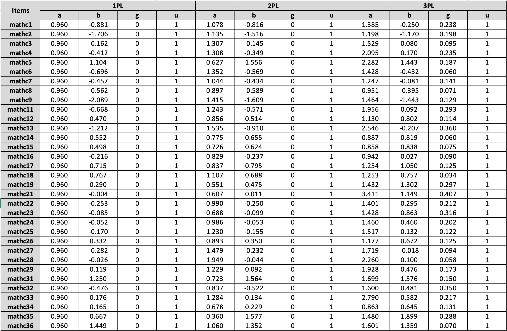

```{=latex}
\setcounter{tocdepth}{4}
\tableofcontents
```
```{r setup, include=FALSE}
## Global options
knitr::opts_chunk$set(
  cache = TRUE,
  prompt = TRUE,
  comment = '',
  collapse = TRUE,
  warning = FALSE,
  message = FALSE)
```   

## Q1-a-Parameters-Estimation

*Fit the 1PL, 2PL, and 3PL models...report the estimated item parameters in separated tables*  

**My Solution:**  
To make the layout concise and good-looking, I intentionally omitted the codes for data cleaning and some instant display of running outcomes. I attached the estimated item parameters from all three models into one table to save space.  

```{r}
# load the binary response dataset
library(mirt)
df <- read.csv("/Users/panpeter/Desktop/PhD_Learning/HUDM6052 Psychometric II/HUDM6052_Psychometic_II/assignment 4/binary_reponses.csv")
df <- df[,-1]

# --------------------------------------------------
#                       Run 1PL
# --------------------------------------------------

# specify the model for 33 items loading on 1 dimension
# and constrain all the item slope to be equal for 1PL estimation
spec <- 'F = 1-33
CONSTRAIN = (1-33, a1)'

# estimated the model
# since I constrained all slopes to be equal, here the argument "2PL" is safe
irt_1pl <- mirt(df, model = spec, itemtype = "2PL", SE=T)
irt_1pl

```
```{r, include=FALSE}
# get the estimated parameters
items_1pl <- as.data.frame(coef(irt_1pl, IRTpars=T, simplify=T)$items)
```
```{R}
# --------------------------------------------------
#                       Run 2PL
# --------------------------------------------------
irt_2pl <- mirt(df, model = 1, itemtype = "2PL", SE=T)
irt_2pl
```
```{r, include=FALSE}
# get the estimated parameters
items_2pl <- as.data.frame(coef(irt_2pl, IRTpars=T, simplify=T)$items)
```
```{R,results=FALSE}
# --------------------------------------------------
#                       Run 3PL
# --------------------------------------------------
# specify the model
spec <- 'F = 1-33
PRIOR = (1-33, g, norm, -1.1, 2)'
irt_3pl <- mirt(df, model = spec, itemtype = "3PL", SE = T)  
```
```{R}
print(irt_3pl)
```  

```{r, include=FALSE}
# get the estimated parameters for the 3PL
items_3pl <- as.data.frame(coef(irt_3pl, IRTpars=T, simplify = T)$items)
# attach all estimated parameters from 3 models
items_all <- cbind(items_1pl, items_2pl, items_3pl)
write.csv(items_all, file = "/Users/panpeter/Desktop/PhD_Learning/HUDM6052 Psychometric II/HUDM6052_Psychometic_II/assignment 4/all_estimated_items.csv")
```  
  

Due to the limitation of `mirt package`, I can't constrain all the $\alpha$ to be 1. Rather, I can only set them to be equal across all the items. Therefore, in the estimation for the 1PL, the estimated universal $\alpha$ is .96 here.  
  
  
## Q1-a-(1)

*Does it appear reasonable to assume all the items having an equal slope...*  

**My Solution:**  
No.  
  
  
From a aspect of test development, since this is a test about math placement, we should expect that items can discriminate students with different traits well. In addition, comparing the estimated parameters from `2PL` model versus `1PL`, these items' levels of discrimination spread along a wide range. It is reasonable to have items with higher levels of discrimination than others.  

From a mathematics perspective, since the 1PL model is nested in the 2PL model, I conducted the `Likelihood Ratio Test` to compare the two models as followed: $$D = -2[ln(L_{1pl})-ln(L_{2pl})] .$$  
Plug the log likelihood estimated from the above code chunck, then one can have $D = 363.2$ at the degree of freedom of $df = df_{2pl}-df_{1pl} = 66-34 =32$. Based on the Chi-squared distribution, the p value is lower than .001. Therefore, 2PL is better than 1PL, which means the discrimination is preferred.  

  
## Q1-a-(2)

*Does it appear useful to include a guessing parameter in the model...*  

**My Solution:**  
  
Yes, it is useful.  

Intuitively, it is reasonable to include a guessing parameter since this a test with multiple choice and guessing is very possible. In addition, by looking through all the guessing parameters, one can find that the `matchc13`, `matchc21`, and `matchc32` do have quite high guessing rate, i.e., all above .30.  
  
However, in terms of model comparison, when using the LRT test again to compare the 2PL vs 3PL model, one can have $D = 28.28$ at $33$ degree of freedom, $P = .701$. Based on the parsimony rule, one should endorse the simpler model, i.e., the 2PL.  
  
Therefore, my overall conclusion is including a guessing parameter is useful in this scenario. A practitioner should choose the either model based on their purpose since these two models do not differ a lot.  

  
## Q1-a-(3)

*Evaluate the goodness of fit of the items with the option of the chi-square test...*  

**My Solution:**  
  
I conduct the item fit analysis on each model and summarize the results into one table to make the layout concise.  
```{r}
# get the item fit indices for each model
item_fit_1pl <- itemfit(irt_1pl, na.rm = T)
item_fit_2pl <- itemfit(irt_2pl, na.rm = T)
item_fit_3pl <- itemfit(irt_3pl, na.rm = T)

# combine all the outputs into one table
item_fit_all <- cbind(item_fit_1pl[,c("item")],
                      round(item_fit_1pl[,c("S_X2", "p.S_X2")],4),
                      round(item_fit_2pl[,c("S_X2", "p.S_X2")],4),
                      round(item_fit_3pl[,c("S_X2", "p.S_X2")],4))
names(item_fit_all)[1] <- "item"

# get all the item fit indices for 1PL, 2PL, and 3PL model
item_fit_all
```  
Item `mathc5` shows bad item fit in all three models. In addition, `matchc19`, `matchc21`, `matchc27`, `matchc28`, `matchc31`, `matchc34`, and ``matchc35` show bad fit in 1PL model only.

## Q1-a-(4)  

*Evaluate the overall fit of the model. Which model do you prefer for this data?...*  

**My Solution:**  
```{r}
# get the fit indices for 1PL model
M2(irt_1pl, na.rm = T)

# get the fit indices for 2PL model
M2(irt_2pl, na.rm = T)

# get the fit indices for 3PL model
M2(irt_3pl, na.rm = T)
```  
Past studies have recommended that a TLI of or above .95, a CFI of or above .95, an RMSEA of or below .05, and an SRMR of or below .05 could indicate a very good fit. Based on those criteria, all three model demonstrate very good model fit.  
  
Next, by conducting the Likelihood Ratio Test (LRT) on 1PL vs. 2PL and 2PL vs. 3PL (finished in `Q1-a-(1)` and `Q1-a-(2)`), 2PL is preferred since it is significantly different from 1PL. In addition, LRT shows there is no significant difference in 2PL and 3PL. Based on the parsimony rule, I prefer 2PL model on this data.  
  
  
## Q1-a-(5)  

*Using the estimates obtained from the model you choose in part...*  

**My Solution:**  
  
In the selected 2PL model, `matchc 28` shows the highest level of discrimination with $\alpha = 1.949$, and `matchc 35` has the lowest level of discrimination.  
    
Next, to find the most informative item on a given trait level, I write a function that automatically search for the targeted item.  
```{r}
# write a function to find the most informative item for a given trait

most_info <- function(irt_model, trait){
  # irt_model can be any estimated IRT model
  # trait can be any given trait level
  a <- 0
  item_num <- 0
  for (i in 1:33){
    # extract the item information at a given trait
    info_temp <- iteminfo(extract.item(irt_model, i), trait)
    # dynamically updated the best target
    if (info_temp > a){
      a <- info_temp
      item_num <- i
    }
  }
  out <- list(item_num = item_num, 
              info_value = a)
  return(out)
}
```  
  
Then, I applied this function to find the most informative items on the given trait levels of $\theta = -1.5$, $\theta = 0$, and $\theta = 1.5$.  

```{r}
# using a for loop to get all results in one sitting
for (theta in c(-1.5, 0, 1.5)){
  theta_out <- most_info(irt_2pl, theta)
  print(paste0("The most informative item on given trait theta=", theta," is the item ", theta_out$item_num, ", i.e., the ", item_fit_2pl$item[theta_out$item_num]))
  print(paste0("     with the infomation value of ", round(theta_out$info_value,4)))
}
```  
  
As shown above, the most informative item on $\theta = -1.5$ is the item `matchc9`. The most informative item on $\theta = 0$ is the item `matchc28`. The most informative item on $\theta = 1.5$ is the item `matchc36`.  

## Q1-b  

*Using the estimates obtained from the model you choose in part...*  

**My Solution:**  
The 1PL model is reasonable to solve this question since total score is sufficient to estimate the parameters, which means all the students with the same total score will have the same estimated trait level.   
  
Since some of the response vectors contain `NA` values and `mirt` will impute the missing data, I need to select the students who got 20 in total raw score and are without any missing responses. 
```{r}
# get the estimated person trait
# find the trait level who have the true score of 20
theta <- fscores(irt_2pl, method = 'EAP')
tscore <- expected.test(irt_2pl, theta)
t_t <- data.frame(
  theta= theta,
  tscore = tscore
)
t_t <- round(t_t,3)
theta_20 <- t_t[t_t$tscore == 20,]$F1
t_t[t_t$tscore == 20,]
```  
  
  
The results show that the trait level of true score 20 is `r theta_20`. Therefore, we need to select 10 items to have the maximum information on the `r theta_20`.  
  
Next, I try to get the information values of each item on `r theta_20` and sort these values in decreasing order. Finally, select the first ten items to make the shorter test.  
  
  
```{r}
info_set <- c()
# using a for loop to get all info value at this given trait
for (i in 1:33) {
  info_tempt <- iteminfo(extract.item(irt_1pl, i), theta_20)
  info_set[i] <- info_tempt
}
# make a new df
info_matrix <- data.frame(
  item = item_fit_1pl[,c("item")],
  info_value = info_set
)
# sort this df in decreasing order
info_matrix <- info_matrix[order(-info_matrix$info_value),]
# get the first 10 items
info_matrix[c(1:10),]
```  
  
As shown above, I will select these ten items to create a shorter version of test.  
```{r}
df_short <- df[,which(names(df) %in% info_matrix$item[1:10])]
# fit 2PL on this short test
irt_2pl_short <- mirt(df_short, model = 1, itemtype = "2PL", SE=T)
irt_2pl_short
```  

Now to get the person trait estimation. 
```{r}
# get the estimated person trait
mirt_trait_out <- fscores(irt_2pl_short, method = 'EAP', full.scores = F, full.scores.SE = T)
mirt_trait <- as.data.frame(mirt_trait_out)
mirt_trait <- round(mirt_trait[which(complete.cases(mirt_trait)),c(11:12)],3)
library(latticeExtra)
key = list(colums=1,
           text=list(lab = c("TCC_overall","TCC_10")),
           lines=list(lwd=4, col=c("blue","lightblue")))
p1 <- plot(irt_2pl, type= "info",key=key)
p2 <- update(plot(irt_2pl_short, type="info"), col="lightblue")
p1+p2
```


